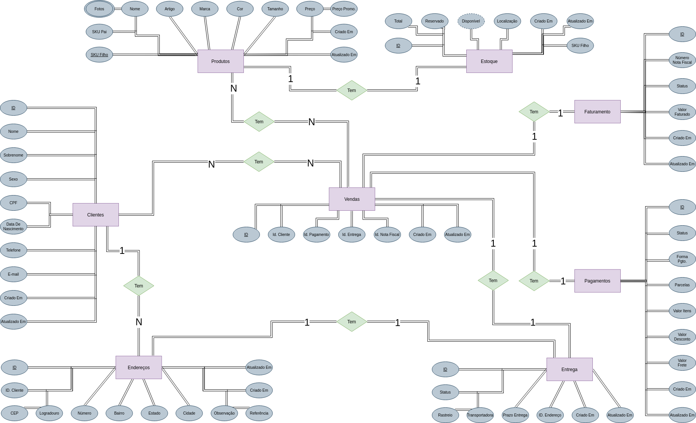

# Modelo Conceitual de Banco De Dados para E-Commerce 👨‍💼

Bem-vindo(a) ao meu projeto de modelo conceitual de banco de dados para E-commerce! Neste projeto, idealizo a organização de uma loja online focando em cobrir as operações básicas para o funcionamento de uma loja na internet.

## Cenário ☕️

- **Clientes:** (Id, Nome, Sobrenome, Sexo, Data De Nascimento, CPF, Telefone, E-mail, Criado Em, Atualizado Em)
- **Endereços:** (Id, Id. Cliente, CEP, Logradouro, Número, Bairro, Cidade, Estado, Observação, Referência, Criado Em, Atualizado Em)
- **Produtos:** (SKU Filho, SKU Pai, Nome, Artigo, Marca, Cor, Tamanho, Fotos, Preço, Preço Promocional, Criado Em, Atualizado Em)
- **Estoque:** (Id, SKU Filho, Disponível, Reservado, Total, Localização, Criado Em, Atualizado Em)
- **Vendas:** (Id, Status, Id. Cliente, Id, Pagamento, Id. Entrega, Id. Nota Fiscal, Criado Em, Atualizado Em)
- **Entregas:** (Id, Status, Cód. Rastreio, Transportadora, Prazo De Entrega, Id. Endereço, Criado Em, Atualizado Em)
- **Pagamentos:** (Id, Status, Forma de Pagamento, Parcelas, Valor Itens, Valor Desconto, Valor Frete, Criado Em, Atualizado Em)
- **Faturamento:** (Id, Número Nota Fiscal, Status, Valor Faturado, Criado Em, Atualizado Em)

## Modelagem Conceitual 🦄

O modelo conceitual do Diagrama Entidade-Relacionamento pode ser acessado no arquivo *modelo_conceitual.drawio* ou visualizando a imagem abaixo:
<iframe frameborder="0" style="width:100%;height:1110px;" src="https://viewer.diagrams.net/?tags=%7B%7D&highlight=0000ff&edit=_blank&layers=1&nav=1&title=modelo_conceitual.drawio#Uhttps%3A%2F%2Fraw.githubusercontent.com%2Fjmlandi%2Fecommerce-database%2Fmain%2Fmodelo_conceitual.drawio"></iframe>

## Modelagem Lógica 🖥️

## Dados 📜

## CRUD ⚡

## Relatórios 💡
